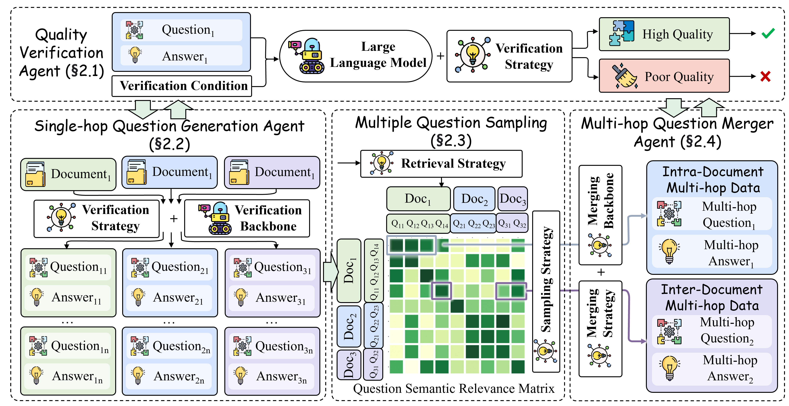

# LongMIT: Essential Factors in Crafting Effective Long Context Multi-Hop Instruction Datasets
<p align="center">
  	<b>
    [<a href="https://arxiv.org/pdf/2409.01893">📑ArXiv</a>] | [<a href="https://huggingface.co/datasets/donmaclean/LongMIT-128K">🤗HuggingFace</a>]
    </b>
    <br />
</p>

<div align=center></div>

## 🤗 Download LongMIT Datasets
```python
def download_longmit_datasets(dataset_name: str, save_dir: str):
    qa_pairs = []
    dataset = load_dataset(dataset_name, split='train', cache_dir=HFCACHEDATASETS, trust_remote_code=True)
    for d in dataset:
        all_docs = d['all_docs']

        if d['type'] in ['inter_doc', 'intra_doc']:
            if d['language'] == 'en':
                content_key = 'Passage {pi}:\n'
                # with CoT
                instruction_format = 'Answer the question based on the given passages.\n\nThe following are given passages.\n{concat_content}\n\nAnswer the question based on the given passages and provide a complete reasoning process.\nQuestion:{q}\nAnswer:'
            else:
                content_key = '文章 {pi}：\n'
                # with CoT
                instruction_format = '根据给定的段落回答问题。\n\n以下是给定的段落。\n{concat_content}\n\n请结合上面材料回答以下问题，并且给出完整的推理过程。\n问题：{q}\n答案：'
        else:
            if d['language'] == 'en':
                content_key = 'Passage {pi}:\n'
                instruction_format = 'Answer the question based on the given passages. Only give me the answer and do not output any other words.\n\nThe following are given passages.\n{concat_content}\n\nAnswer the question based on the given passages. Only give me the answer and do not output any other words.\nQuestion:{q}\nAnswer:'
            else:
                content_key = '文章 {pi}：\n'
                instruction_format = '根据给定的段落回答问题。只给答案，不要输出任何其他单词。\n\n以下是给定的段落。\n{concat_content}\n\n请结合上面材料回答以下问题。只给答案，不要输出任何其他单词。\n问题：{q}\n答案：'

        concat_content = '\n'.join([content_key.format(pi=di+1)+doc['content'] for di, doc in enumerate(all_docs)])
        question =  d['question']
        answer = d['answer']

        qa_pairs.append(json.dumps(
            {
                'prompt': instruction_format.format(concat_content=concat_content, q=question),
                'output': answer
            }
        )+'\n')

    if not os.path.exists(save_dir):
        os.makedirs(save_dir)

    with open(os.path.join(save_dir, 'train.jsonl'), 'w') as fw:
        fw.write(''.join(qa_pairs))
```

## 🍴 Build Your Custom LongMIT Datasets

### 🌏 Environments
```shell
git https://github.com/WowCZ/LongMIT.git
cd LongMIT
git clone https://github.com/WowCZ/InternEmbedding.git
pip install -r requirements.txt
```
* Note: [InternEmbedding](https://github.com/WowCZ/InternEmbedding) is a submodule of this repository.

### 🚀 Crafting Long Context MIT
#### 1. Organize the private text corpus with embedding models
##### Step-1: Embedding source text corpus:
```shell
python doc_process/embed_doc.py --config doc_process/config/embedding/embedding_example.yaml --num_process_nodes 8
```
*  The config of text corpus has four components as following:
```yaml
data:
  domain: wiki # source domain of text corpus
  input_dir: assets/example_datasets # path of original text files
  doc_glob: "*_text_corpus.jsonl" # matched format of text files
  embed_output_dir: your_local_path # temporary folder to save embedding files
```
where *domain* is the domain name of your custom text corpus, *input_dir* is the path of the text corpus, *doc_glob* is the matched format of the text files (must being jsonl format) and *embed_output_dir* is the saving path for temporary embedding files. In the jsonl text file, each example has two keys: *id* and *content*, like (*assets/example_datasets/custom_text_corpus.jsonl*)
```json
{
    "id": "xxx",
    "content": "xxx",
}
```
* Note: The embedder config normally need not change (just care about the langue mode).

##### Step-2: Build document graph with approximated knn
```shell
python doc_process/build_doc_graph.py --command train_index --config doc_process/config/faiss/example_knn.yaml --xb example
wait

python doc_process/build_doc_graph.py --command index_shard --config doc_process/config/faiss/example_knn.yaml --xb example 
wait

python doc_process/build_doc_graph.py --command search --config doc_process/config/faiss/example_knn.yaml --xb example
wait
```

##### Step-3: Traverse document graph
```shell
python doc_process/traverse_doc_graph.py
```
* The traversed document path is formated as shown in *assets/example_datasets/organized_text_corpus.jsonl*, like
```json
{
    "id_path": ["xxx", "xxx"],
    "content_path": ["xxx", "xxx"],
}
```

#### 2. Multi-Agent-Driven LongMIT Data Synthesis
```shell
python agent/distribute_run_agents.py --config agent/configs/longqa_example.yaml
```
* The synthesis multi-hop QA dataset is formated as shown in *assets/example_datasets/longmit_4hop_datasets.jsonl*, like
```json
{
    "aggregated_docs": ["xxx", "xxx"],
    "intra_doc_qas": ["xxx", "xxx"],
    "multihop_qas": ["xxx", "xxx"],
    "selected_qa_ids": ["xxx", "xxx"],
    "clustered_mqa_info": ["xxx", "xxx"],
    "token_count": 131072,
}
```

## 🧷 Citation

If you find the content of this repo useful in your work, please cite it as follows via `\usepackage{biblatex}`:

```bibtex
@article{chen2024essential,
  title={What are the Essential Factors in Crafting Effective Long Context Multi-Hop Instruction Datasets? Insights and Best Practices},
  author={Chen, Zhi and Chen, Qiguang and Qin, Libo and Guo, Qipeng and Lv, Haijun and Zou, Yicheng and Che, Wanxiang and Yan, Hang and Chen, Kai and Lin, Dahua},
  journal={arXiv preprint arXiv:2409.01893},
  year={2024}
}
```