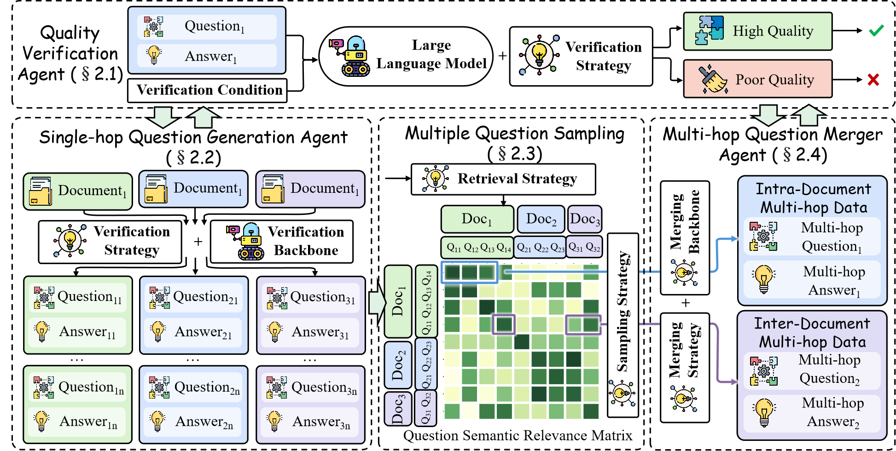

# LongMIT: Essential Factors in Crafting Effective Long Context Multi-Hop Instruction Datasets

<div align=center></div>

## 🌏 Environments
### Reliant Repository
```shell
git https://github.com/WowCZ/LongMIT.git
cd LongMIT
git clone https://github.com/WowCZ/InternEmbedding.git
pip install -r requirements.txt
```

## 🚀 Crafting Long Context MIT
### 1. Organize the private text corpus with embedding models
#### Step-1: Embedding source text corpus:
```shell
python doc_process/embed_doc.py --config doc_process/config/embedding/embedding_example.yaml --num_process_nodes 8
```

#### Step-2: Build document graph with approximated knn
```shell
python doc_process/build_doc_graph.py --command train_index --config doc_process/config/faiss/example_knn.yaml --xb example
wait

python doc_process/build_doc_graph.py --command index_shard --config doc_process/config/faiss/example_knn.yaml --xb example 
wait

python doc_process/build_doc_graph.py --command search --config doc_process/config/faiss/example_knn.yaml --xb example
wait
```

#### Step-3: Traverse document graph
```shell
python doc_process/traverse_doc_graph.py
```
### 2. Multi-Agent-Driven LongMIT Data Synthesis
```shell
python agent/distribute_run_agents.py --config agent/configs/longqa_example.yaml
```

## Citation

If you find the content of this repo useful in your work, please cite it as follows via `\usepackage{biblatex}`:

```bibtex
@article{chen2024what,
  title={What are the Essential Factors in Crafting Effective Long Context Multi-Hop Instruction Datasets? Insights and Best Practices},
  author={Zhi Chen, Qiguang Chen, Libo Qin, Qipeng Guo, Haijun Lv, Yicheng Zou, Wanxiang Che, Hang Yan, Kai Chen, Dahua Lin},
  journal={arXiv preprint arXiv:xxx},
  year={2024}
}
```